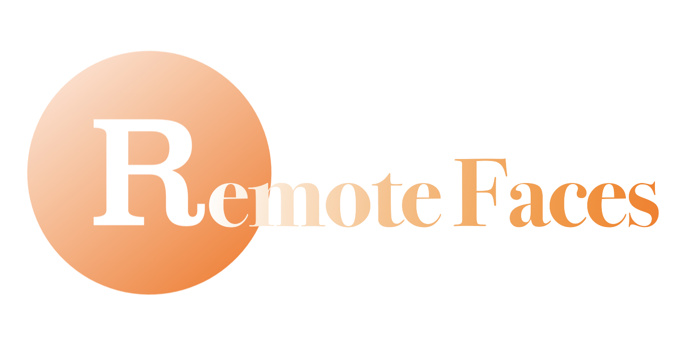

# Remote Faces

A small app to share webcam still images periodically

## Motivation

Working from home is a working style that has existed
and is usual nowadays.
Tools such as instant messaging and video conferencing
allow working from home.
Those tools are useful and mandatory, but it turns out that
it would also be nice to have another tool to feel connected.

"Remote Faces" is a small app to share a webcam still image.
The image will be updated only periodically.
The size of the image is small enough to keep your privacy to some extent.
It doesn't involve a server to transfer image data,
but it's done in a peer-to-peer manner.

## Goal

The goal of this project is to provide a tool for people working from home.
The tool will be kept running during working and used occasionally.
It would fill the gap between working in office and working from home.
It would be complementary to more active tools like email,
messaging, phone and scheduled video calls.

Although not a primary goal, as we take privacy seriously,
our technology focus is for peer-to-peer network.

## How to use

Just visit the following link to jump to the latest tool.

<https://remote-faces.js.org>

Google Chrome on PC is recommended.
It may work on other browsers including some on mobile.

You may also [Select Remote Faces Versions](https://dai-shi.github.io/remote-faces/tools/select.html) in case the latest version has some issues.

To create a new room, click the button and the app starts immediately.
Copy the URL and share it with your colleagues.
It will take your face image with webcam every two minuites.
At first, you will only see your face,
but once your colleagues enter the room,
face images are broacasted within the room.
Note this app is based on peer-to-peer technology,
and the images are only transferred in the participants of the room.

If you are trying this app for the first time,
you can open the app in multiple tabs in Chrome.
You can open it as many as you want and simulate
the app behavior with many participants.

If you have a question, don't hesitate to
[open an issue](https://github.com/dai-shi/remote-faces/issues/new/choose)
for it.

## How to contribute

This is an open source project and your contribution is important.
The web app is built with [React](https://reactjs.org) and
[IPFS](https://github.com/ipfs/js-ipfs) PubSub
with [WebRTC](https://developer.mozilla.org/en-US/docs/Web/API/WebRTC_API),
alternatively [PeerJS](https://peerjs.com).

We welcome your contribution at any level; from coding,
issue reporting, bug fixing, discussing features, documentation
and to promotion!

For more information, check out [CONTRIBUTING.md](./CONTRIBUTING.md).

## Screenshots (Legacy Version)

## Downloads

Once you are used the tool, you might want a standalone app.
Technically, it's just a wrapper and features are basically the same.
If you are not familiar, you can continue using Chrome to use the app.

<https://github.com/dai-shi/remote-faces/releases>

## Blogs

- [Remote Faces: Share webcam still images with PeerJS/WebRTC](https://medium.com/@dai_shi/remote-faces-share-webcam-still-images-with-peerjs-webrtc-a7ed5fe11e49)
